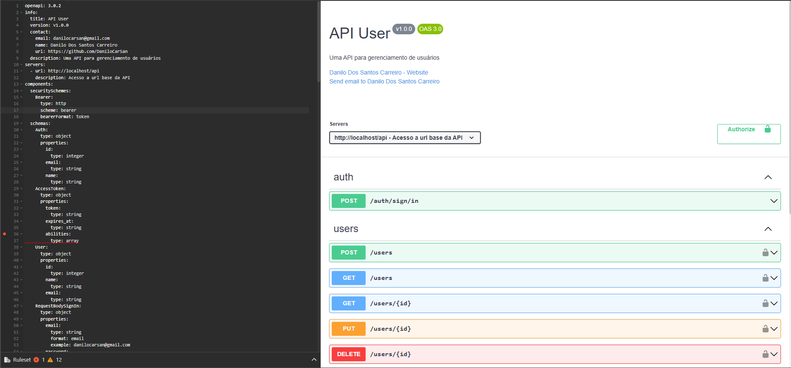

#  ApiUser

## PASTA PRINCIPAIS DO CÓDIGO DESENVOLVIDO

- /app/Business
- /app/Http/Controllers/Api
- openapi.yml
- /docs/api-docs.html
- /tests/Feature
- /tests/Unit

# Pré requisitos para execução do ambiente de teste

- PHP: 8.4
- [Docker] : ^26
- [Composer] : ^2.2

## Técnologias Utilizadas

- Docker/ Docker compose
- PHP
- Laravel
- Laravel Sail
- mailpit
- Mysql
- PHPUnit
- OpenApi(swagger)
- Git | Github | Github Actions(CI)

# Executando aplicação (de uma olhada no arquivo Makefile)

**1 - Na raiz do projeto rode o comando abaixo para baixar as dependências do projeto (composer deve estar instalado)**

````
composer install
````

**2 -  Caso tenha o utilizatário make instalado execute o comando abaixo na raiz do projeto**

````
make start
````

ou

````
cp .env.example .env
sed -i 's/DB_HOST=localhost/DB_HOST=mysql/g' .env
php artisan key:generate
./vendor/bin/sail up -d
docker exec -it apiusers-laravel.test-1 bash -c "chmod -R 777 ." 
````

**3 - Para configurar o banco(criar tabeles + dados fake) execute o comando abaixo**
````
make migrate
````

ou

````
./vendor/bin/sail artisan migrate:refresh --seed
````

**4 - A aplicação será executada e os seguintes serviços estarão disponíveis, caso tenha duvida visualize o docker-compose arquivo**

````
Aplicação: http://localhost
mysql= http://localhost::3306
mailpit= http://localhost:8025
````

## Executar os testes

````
make test
````

ou 

````
./vendor/bin/sail test
````


## Documentação da api com Openapi

A documentação se encontra na página inicial da aplicação **http://localhost/** ou **./docs/api-docs.html**, quando executada, ou você pode visualizar a espeficificação no arquivo
**openapi.yml** na raiz do projeto.

Para facilitar a visualização ou até mesmo testar você pode estar importando o arquivo dentro do
insomnia ou no vscode com a extenção **42Crunch.vscode-openapi**



## Rotas da API:

- Autenticar-se: http://localhost/api/auth/sign/in
- Listar usuários: http://localhost/api/users
- Obter usuário especifico: http://localhost/api/users/{id}
- Excluir usuário especifico: http://localhost/api/users/{id}
